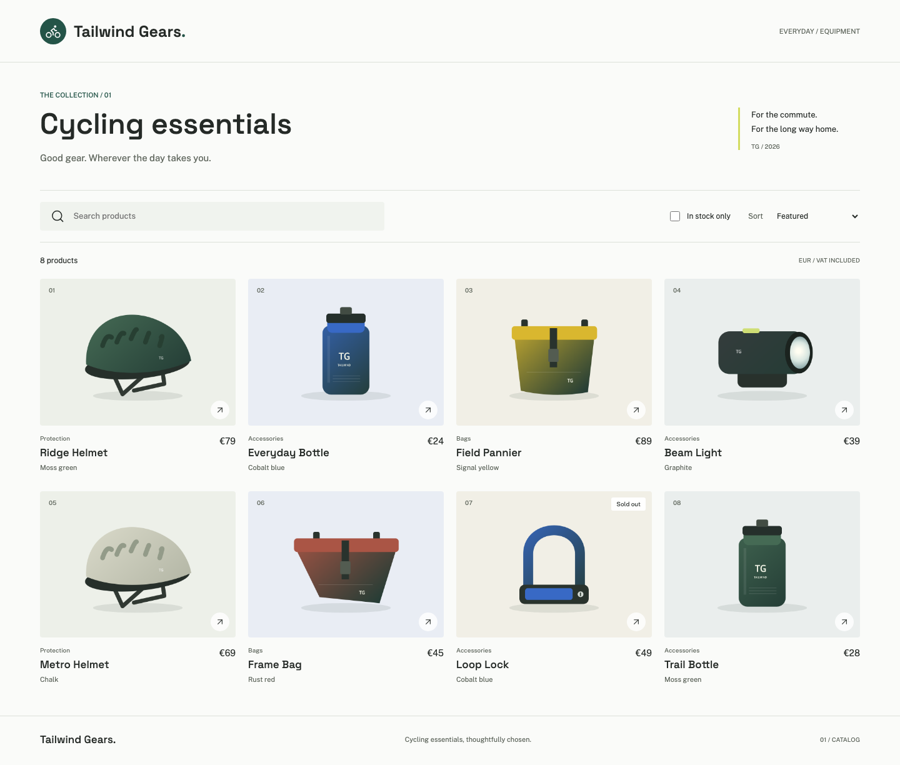

# Tailwind Gears

A small cycling catalog for **Accelerate DevOps with GitHub, second edition**. One application to plan, change, test, review, and eventually deploy. It is a fictional teaching sample, not a real shop or production-ready commerce service.



## Run locally

Use Node.js 24 LTS and npm. No database, cloud account, secrets, or AI subscription is required.

```sh
npm ci
npm run dev
```

Open <http://localhost:5173>. The same process serves the API and frontend. If that port is occupied, set `PORT` to another port before running the command (for example `PORT=5174 npm run dev` on macOS/Linux, or `$env:PORT=5174; npm run dev` in PowerShell).

To run the built application:

```sh
npm run build
npm start
```

The server binds to loopback by default. Set `HOST=0.0.0.0` only when you intend to expose it, such as in a container. Keep development servers private.

## Intentional teaching bug

**Search is case-sensitive in the starting version.** `Helmet` finds two helmets; `HELMET` and `helmet` find none. This is deliberate. Normal tests pass because they describe the existing supported behavior, not because the application is defect-free.

```sh
npm run test:exercise
```

This command **must fail on the starting version**. It expresses the desired case-insensitive behavior. Fixing it is the bounded Chapter 2 agent exercise. Add permanent regression tests when you implement the fix; do not remove or relax the exercise assertion.

Category filtering is a separate, unimplemented feature for planning. Categories are already present in the data. Search, price/name sorting, stock filtering, empty/error states, URL state, and accessible product details work without it.

Start with the [Chapter 2 exercise](docs/chapter-02/README.md), [two-issue backlog](docs/chapter-02/backlog.json), and [fictional meeting transcript](docs/chapter-02/meeting-transcript.md). Use **Use this template** to create your own repository. Do not run exercises in the author's issue tracker. The tag `chapter-02-start` identifies the initial baseline.

## Verify

```sh
npm run check
npx playwright install chromium
npm run test:e2e
```

`check` runs the unit/API/tooling tests and a strict TypeScript production build. Playwright starts a separate built server on port 5199, exercises desktop/mobile behavior, and saves screenshots in the ignored `test-results/` directory. Stop anything already using port 5199 before running it. The intentional acceptance failure is excluded from normal CI.

## Find the code

| Location | Responsibility |
| --- | --- |
| `server/catalog.ts` | Synthetic products and search/sort/filter behavior |
| `server/app.ts` | Express API and query validation |
| `server/index.ts` | Single-process development/production server |
| `shared/product.ts` | Product contract |
| `src/catalog.ts` | Browser UI and request handling |
| `src/catalog.css` | Responsive styling |
| `tests/`, `e2e/` | Unit, API, tooling, and browser regression tests |
| `exercises/` | Explicitly failing teaching checks |
| `scripts/seed-issues.ts` | Preview-first, repeatable issue creation |

API endpoints: `GET /api/health`, `GET /api/products?q=Helmet&sort=price-asc&inStock=true`, and `GET /api/products/ridge-helmet`. Supported sorts are `featured`, `name`, `price-asc`, and `price-desc`. Prices are integer euro cents. Product data is read-only and resets with the code; there is no checkout, inventory mutation, or persistence.

## Artwork and provenance

The product images are original programmatic PNG illustrations, not real product photography or third-party documentation images. They depict fictional products; sizes, materials, prices, and other specifications are synthetic fixtures, not safety or performance claims. Regenerate them with `npm run assets`. This sample does not reuse Tailwind Traders code or assets.

Lucide icons and the bundled Public Sans and Space Grotesk fonts retain their upstream licenses. `npm run build` copies their full notices to `public/licenses/third-party.txt` and the distributable. See [AI assistance and provenance](docs/AI_USE.md) before using this material in a publication. These web assets are not Packt manuscript figures.

The existing [book companion repository](https://github.com/wulfland/AccelerateDevOps) remains the first-edition resource hub. This repository is the independent second-edition application baseline.
